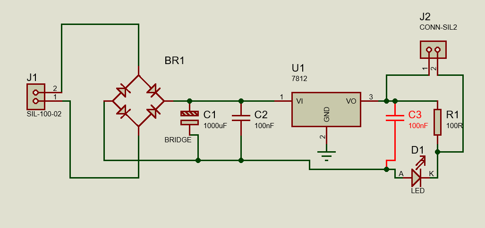
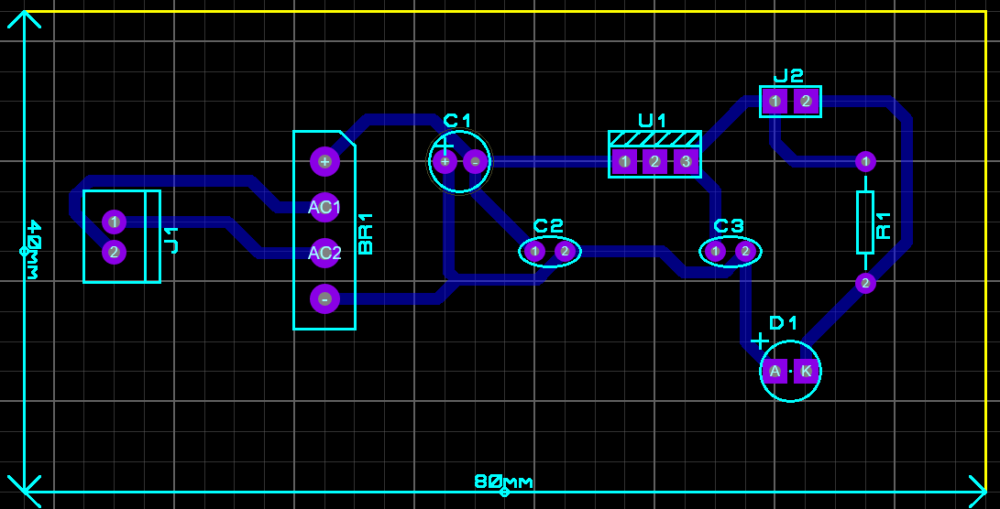
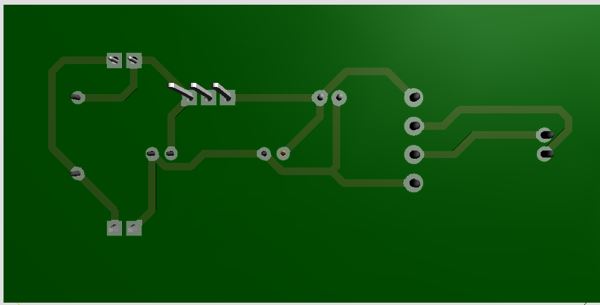
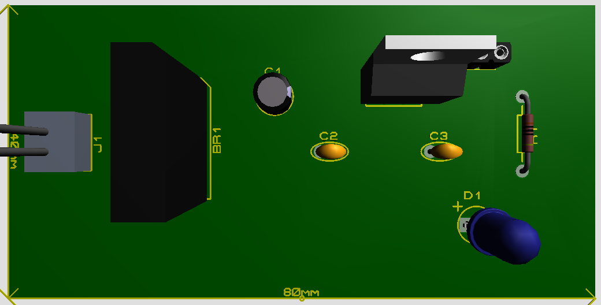

# Prototipo de Carregador

## Descrição

Este projeto apresenta o desenvolvimento de um Prototipo de um carregador utilizando uma ponte retificadora e o regulador de tensão 7812.

O circuito recebe uma tensão alternada (AC), converte para corrente contínua (DC) e regula a saída em 12V.

Este tipo de fonte é muito utilizado para alimentar circuitos eletrônicos, microcontroladores e projetos embarcados.

---

# Esquemático do Circuito

---

# Layout da PCB

---

# Trilhas da Placa

---

# Visualização 3D da Placa

---

# Componentes Utilizados

| Componente | Função |
|------------|--------|
J1 | Entrada da tensão AC |
BR1 | Ponte retificadora |
C1 | Capacitor de filtragem |
C2 | Capacitor de desacoplamento |
U1 (7812) | Regulador de tensão |
C3 | Capacitor de estabilização |
R1 | Limitador de corrente |
D1 | LED indicador |
J2 | Saída da fonte |

---

# Tensão de Saída

Saída regulada:

# Aplicações

Esta fonte pode ser utilizada para alimentar:

- Microcontroladores
- Circuitos digitais
- Sensores
- Projetos eletrônicos
- Protótipos em bancada

---

# Autor

Projeto desenvolvido por **Vitor dos Santos Moreira**.